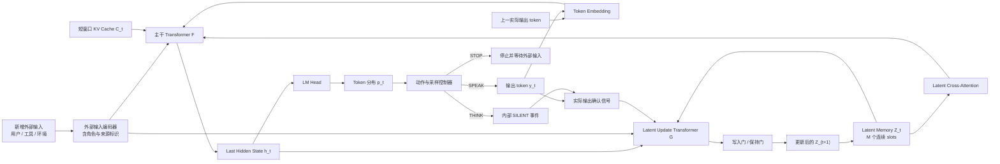
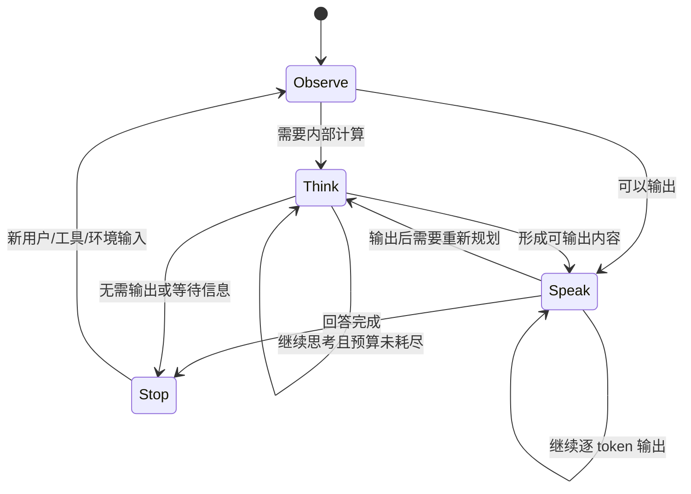
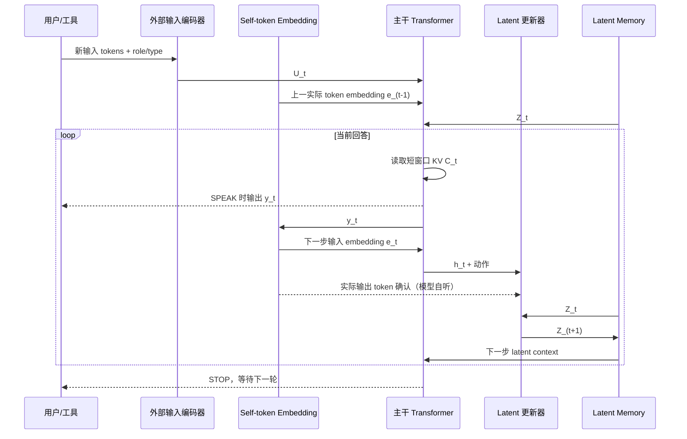
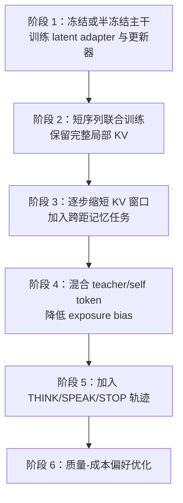

# LatentLoop：双通道连续状态自回归语言模型方案

> 状态：研究方案草案 v0.1  
> 日期：2026-07-25  
> 目标：在保留标准 token 自回归一致性的同时，引入可跨 token、跨句子和跨对话轮次传播的连续 latent memory，并支持无外显 token 的内部思考步骤。

## 1. 摘要

LatentLoop 是一种双通道语言模型架构：模型一方面像标准自回归 Transformer 一样输出 token，并把实际输出 token 反馈给下一步，使模型能够“听见自己刚才说了什么”；另一方面，将当前最后一层隐藏状态写入独立的连续 latent memory，用于保存未被单个离散 token 完整表达的目标、计划、约束、语义和跨轮信息。

该方案不以 latent state 替代 token 通道，而是让两者形成不同时间尺度的互补机制：

- token/KV 通道保存近期、精确、可观察的语言历史；
- latent memory 保存长期、压缩、连续的内部状态；
- 用户、工具和环境输入作为外部事件注入，带独立来源标识；
- 控制器在 `THINK`、`SPEAK` 和 `STOP` 三种动作间选择，允许模型只更新内部状态而不产生外显文本。

核心研究问题不是 latent 分支能否获得梯度，而是如何通过结构约束、时间尺度分离和训练任务，使它真正承担长期信息，而非复制 token embedding 或被完整 KV Cache 忽略。

## 2. 设计目标与非目标

### 2.1 设计目标

1. **保持自回归一致性**：未来生成条件于实际输出 token，而不是仅条件于输出前的概率分布。
2. **连续信息传播**：隐藏状态中的高维信息无需完全经过离散 token 瓶颈即可跨步传播。
3. **跨轮长期记忆**：latent memory 主要承载目标、约束、计划和较早对话信息。
4. **支持静默思考**：内部状态可以推进若干步而不向用户输出 token。
5. **控制缓存增长**：长期目标是用固定容量 latent memory 配合短窗口 KV，而不是额外保留无限增长的双份历史。
6. **训练与推理对齐**：逐步引入模型自身输出，降低 teacher forcing 与真实生成之间的分布偏移。

### 2.2 非目标

- 第一阶段不追求完全替代标准 Transformer 或 KV Cache。
- 不假设单个 latent vector 能无损压缩任意长历史。
- 不要求 latent state 可直接翻译为自然语言思维链。
- 不把静默思考等同于可靠推理；它仍需受预算、监督和评测约束。

## 3. 核心概念

设第 $t$ 个生成步包含以下变量：

| 符号 | 含义 |
|---|---|
| $y_t$ | 第 $t$ 步实际输出的 token |
| $e_t=E(y_t)$ | 实际输出 token 的 embedding |
| $h_t$ | 主干模型在当前步的最后层隐藏状态 |
| $Z_t\in\mathbb{R}^{M\times d_z}$ | 固定数量的 latent memory slots |
| $U_t$ | 当前步新增的用户、工具或环境输入表示 |
| $C_t$ | 短窗口局部 KV Cache |
| $a_t$ | 控制动作：`THINK`、`SPEAK` 或 `STOP` |

LatentLoop 将模型的内部状态分为两种时间尺度：

- **快速状态**：token embedding 与局部 KV，每个 token 更新，负责句法、指代和局部一致性；
- **慢速状态**：latent memory，按学习到的写入门更新，负责长期目标、计划和跨轮信息。

### 3.1 $h_t$：当前位置的最后层隐藏状态

$h_t$ 是第 $t$ 个生成位置经过主干 Transformer 最后一层后得到的表示。单个样本在 decode 阶段通常为：

$$h_t\in\mathbb R^{d_{\text{model}}}$$

加入 batch 维后为：

$$h_t\in\mathbb R^{B\times d_{\text{model}}}$$

例如 $B=2$、$d_{\text{model}}=4096$ 时，`h_t.shape = [2, 4096]`。实现中也可能保留长度为 1 的序列维，写成 `[B, 1, d_model]`。

$h_t$ 综合了上一实际输出 token、局部 KV Cache、外部新增输入和 latent memory，是模型在当前位置的快速工作状态。它通常有两个主要去向：

```text
h_t -> LM Head -> logits -> 实际输出 token
h_t -> Latent 更新器 -> 候选长期记忆
```

Prefill 阶段一次处理 $S$ 个位置，最后层输出为 $H\in\mathbb R^{B\times S\times d_{\text{model}}}$；其中最后一个有效位置的向量可记为 $h_S$，用于预测第一个新 token。Decode 阶段每次只有一个新位置，因此通常简写为 $h_t$。

### 3.2 $Z_t$：固定容量的 latent memory

$$Z_t\in\mathbb R^{M\times d_z}$$

表示单个样本包含 $M$ 个 memory slots，每个 slot 是一个 $d_z$ 维连续向量。加入 batch 维后，实际张量通常为：

$$Z_t\in\mathbb R^{B\times M\times d_z}$$

例如 $B=2$、$M=16$、$d_z=2048$ 时，`Z_t.shape = [2, 16, 2048]`。可以将其理解为：

```text
Z_t = [z_t^(1), z_t^(2), ..., z_t^(M)]
```

每个 $z_t^{(i)}$ 都是一个 $d_z$ 维向量。不同 slots 可能在训练中逐渐形成用户偏好、当前目标、重要事实、未完成约束和下一步计划等分工，但默认不人工规定其语义。

$Z_t$ 的容量不随序列长度增长。它保存的是经过学习压缩的长期状态，而不是每个历史 token 的精确副本。多个 slots 相比单个 latent vector 提供更大的容量，也允许主干和更新器通过 attention 选择性读取、写入不同记忆位置。

### 3.3 KV Cache：逐层、逐 token 的注意力记录

对于第 $l$ 层，Key 和 Value cache 的典型形状分别为：

$$K_t^{(l)},V_t^{(l)}\in\mathbb R^{B\times H_{kv}\times S\times D}$$

其中 $H_{kv}$ 是 KV head 数，$S$ 是已缓存的序列长度，$D$ 是每个 head 的维度。例如：

```text
K_cache[layer].shape = [2, 8, 1024, 128]
V_cache[layer].shape = [2, 8, 1024, 128]
```

模型有 $L$ 层时，每层分别保存一组 K/V；逻辑上也可写成 `[L, B, H_kv, S, D]`，但实现中通常按层管理。KV Cache 对历史 token 的记录更精确，但存储量随 $S$ 线性增长。

### 3.4 三种状态的区别

| 状态 | 典型形状 | 是否随序列增长 | 信息粒度 | 主要用途 |
|---|---|---:|---|---|
| $h_t$ | `[B, d_model]` | 否 | 当前生成位置的综合工作状态 | 预测 token，驱动 latent 更新 |
| $Z_t$ | `[B, M, d_z]` | 否 | 长期信息的固定容量压缩表示 | 保存目标、计划、约束和跨轮事实 |
| 每层 KV Cache | `[B, H_kv, S, D]` 各两份 | 是 | 每层、每个历史 token 的精确 K/V | 让当前 Query 注意近期或完整历史 |

三者的关系可以概括为：

```text
KV Cache：历史细节的逐层精确记录
Z_t：长期历史和任务状态的压缩摘要
h_t：当前一步读取 token、KV、Z_t 和外部输入后的即时结果
```

不能简单用 $h_t$ 直接替代 $Z_t$。$h_t$ 只有一个当前位置的向量，并且随每个 token 快速变化；若令 $Z_{t+1}=h_t$，当前措辞和句法信息可能覆盖长期约束。LatentLoop 因此使用多个 slots、独立更新器和写入门，让 $h_t$ 只作为更新长期记忆的信息来源之一。

## 4. 整体架构



### 4.1 三条输入通道

下一步主干模型不应简单接收三个向量的逐元素相加，而应显式区分来源：

1. **Self-token 通道**：上一实际输出 token，保证模型知道自己真正说了什么；
2. **External-event 通道**：用户、工具或环境新增信息，只在事件发生时注入；
3. **Latent-memory 通道**：固定容量连续状态，通过 cross-attention 或 gated adapter 注入。

每条通道应使用独立的 type/role embedding，例如 `SELF_TOKEN`、`USER_TOKEN`、`TOOL_TOKEN`、`LATENT_SLOT` 和 `SILENT_EVENT`。

## 5. 单步状态转移

### 5.1 主干计算与 token 输出

主干模型接收上一实际输出 token、外部新增输入、latent memory 和局部缓存：

$$h_t = F_\theta\!\left(e_{t-1}, U_t, Z_t, C_t\right)$$

词表分布为：

$$p_t = \mathrm{softmax}(W_{\text{vocab}}h_t)$$

当动作是 `SPEAK` 时，从 $p_t$ 中选择实际输出：

$$y_t \sim \mathrm{Decode}(p_t)$$

实际的 $y_t$ 会在下一步重新进入 self-token 通道，从而保持：

$$p(y_{t+1}\mid y_{\leq t},Z_t,U_{\leq t})$$

而不是让未来与本次实际采样结果条件独立。

### 5.2 Latent memory 更新

这一过程可以理解为三步：**形成候选记忆、判断写入多少、融合新旧记忆**。模型不是每生成一个 token 就覆盖全部长期状态，而是只把当前值得长期保存的信息写入相应 slots。

#### 第一步：形成候选记忆

候选状态由独立的更新网络产生：

$$\widehat Z_{t+1}=G_\phi\!\left(Z_t,h_t,A_t,U_t\right)$$

各输入的职责如下：

| 输入 | 含义 |
|---|---|
| $Z_t$ | 更新前已经保存的长期记忆 |
| $h_t$ | 主干模型对当前位置和上下文的综合理解 |
| $A_t$ | 当前实际说了什么，或执行了 THINK/STOP |
| $U_t$ | 当前新增的用户、工具或环境信息 |
| $\widehat Z_{t+1}$ | 更新器建议写入的候选记忆，不会立即覆盖旧记忆 |

例如，旧记忆可能保存“用户要求中文”“当前主题是 KV Cache”“最后需要给计算例子”。当模型完成概念解释时，更新器可以提出候选状态“下一步开始计算例子”，但是否覆盖对应 slot 仍由写入门决定。

#### 第二步：记录实际发生的动作

其中 $A_t$ 是当前动作的确认信息：

$$A_t=\begin{cases}E(y_t)+E_{\text{SPEAK}}, & a_t=\text{SPEAK}\\ E_{\text{SILENT}}, & a_t=\text{THINK}\\ E_{\text{STOP}}, & a_t=\text{STOP}\end{cases}$$

- `SPEAK`：$E(y_t)$ 告诉更新器实际采样并公开输出了哪个 token，$E_{\text{SPEAK}}$ 标记这是外显输出。这样内部状态不会在模型说出“狗”后仍沿着“猫”的分支推进。
- `THINK`：没有用户可见 token，但 `SILENT` 事件告诉更新器发生了一次内部状态推进。
- `STOP`：表示当前回答结束，更新器可以保存跨轮约束、未完成事项或等待状态。

#### 第三步：计算写入门并融合记忆

通过写入门控制更新速度：

$$\alpha_t=\sigma\!\left(W_\alpha[h_t;\mathrm{Pool}(Z_t);A_t;\mathrm{Pool}(U_t)]\right)$$

$$Z_{t+1}=\mathrm{Norm}\!\left((1-\alpha_t)\odot Z_t+\alpha_t\odot\widehat Z_{t+1}\right)$$

$\sigma$ 将写入强度限制到 0 到 1。忽略 `Norm` 时，更新公式就是：

```text
新记忆 = (1 - 写入比例) * 旧记忆 + 写入比例 * 候选记忆
```

- $\alpha_t\approx0$：基本保留旧记忆；
- $\alpha_t\approx1$：主要采用候选记忆；
- 中间值：只做部分更新。

`Norm` 用来稳定连续递归中的数值尺度，避免 latent 向量逐步放大、缩小或漂移。

$\alpha_t$ 可以是全局标量、逐 slot 门或逐维门。首个实现建议采用逐 slot 标量门：

$$\alpha_t\in[0,1]^{B\times M}$$

第 $i$ 个 slot 独立更新：

$$Z_{t+1}^{(i)}=\mathrm{Norm}\!\left((1-\alpha_t^{(i)})Z_t^{(i)}+\alpha_t^{(i)}\widehat Z_{t+1}^{(i)}\right)$$

例如工具返回关键事实时，事实相关 slot 的门值可能接近 1，而用户语言偏好相关 slot 的门值接近 0。普通功能词通常只触发很小的长期写入；用户新增约束、任务目标改变或关键工具结果则应触发较强写入。

完整数据流为：

```text
旧记忆 Z_t ───────────────┐
当前 hidden h_t ──────────┤
实际动作 A_t ─────────────┼─> 更新器 G ─> 候选记忆 Z_hat_(t+1)
新增外部输入 U_t ─────────┘                  │
                                             ├─> 写入门 alpha_t
旧记忆 Z_t ──────────────────────────────────┘
                                             │
                                             v
                      (1-alpha_t)Z_t + alpha_t Z_hat_(t+1)
                                             │
                                            Norm
                                             │
                                             v
                                      新记忆 Z_(t+1)
```

随后，$Z_{t+1}$ 与实际输出 token 的 embedding、下一步外部输入和更新后的局部 KV 一起供主干模型使用：

$$h_{t+1}=F_\theta\!\left(E(y_t),U_{t+1},Z_{t+1},C_{t+1}\right)$$

因此系统存在两条互补反馈路径：实际 token 路径保证模型知道自己真正说了什么；latent 路径保留未被单个 token 完整表达的高维长期信息。

### 5.3 为什么反馈实际 token

连续状态保留输出前的丰富候选信息，但实际采样决定了模型公开选择的分支。把实际 token 作为**确认信号**传入更新器，可以同时满足：

- latent 通道仍是主要连续信息载体；
- 模型知道公开文本已经选择了哪条路径；
- top-p、temperature 和 beam search 下不会出现内部计划与可见文本脱节；
- token embedding 不必直接覆盖或替代 latent memory。

## 6. THINK / SPEAK / STOP 状态机



### 6.1 动作定义

- `THINK`：不产生用户可见 token；写入一个内部 `SILENT_EVENT`，更新 latent memory。
- `SPEAK`：输出实际 token；该 token 在下一步进入 self-token 通道，并参与 latent 更新。
- `STOP`：结束当前响应，冻结或轻量整理 latent memory，等待新的外部输入。

### 6.2 防止无限思考

推理系统必须配置：

- 单次回答最大 THINK 步数；
- 连续 THINK 上限；
- THINK 的计算成本惩罚；
- 超预算后的强制 `SPEAK` 或 `STOP`；
- 对无收益重复状态的收敛/循环检测。

## 7. 跨轮工作流



图中 `S -> F` 是不可省略的 self-token 通道：在正常 `SPEAK` 解码中，上一实际输出 token 的 embedding $e_{t-1}$ 与 $U_t$、$Z_t$ 和局部 KV Cache 一起进入主干 Transformer。原图遗漏这条边是不完整的画法，不代表架构可以省略它。

在一轮回答刚开始时，$e_{t-1}$ 可以是上一轮最后一个 assistant token 的 embedding，也可以是表示角色切换的 `<TURN_START>` 或 `<ASSISTANT>` 边界 embedding；如果当前轮先接收用户输入，则用户输入经过 prefill 后，最后一个用户 token 或 assistant 边界 token 作为首次生成步的 self-token 输入。进入连续生成后，每生成一个实际 token，就将它编码为下一个步的 $e_t$。

用户在生成中追加输入时，将其视为高优先级外部事件。系统应在安全的 token 边界暂停生成，编码新输入并更新 $Z_t$，而不是把用户 token 与模型 self-token 无标识混合。

## 8. 缓存与记忆分工

### 8.1 推荐的混合记忆

| 组件 | 容量 | 时间尺度 | 主要职责 |
|---|---:|---|---|
| Self-token embedding | 1 个或极短历史 | 单 token | 确认刚才实际输出 |
| 局部 KV Cache | 固定窗口 $W$ | 近期 | 精确措辞、局部语法、近距离指代 |
| Latent memory | 固定 $M$ slots | 长期/跨轮 | 目标、计划、约束、较早事实的压缩表示 |
| 外部事件缓存 | 按事件注入 | 稀疏 | 用户、工具、环境的新信息 |

推荐让 KV Cache 采用滑动窗口，使旧信息最终只能通过 latent memory 保留。若保留完整 KV，latent 分支很容易退化为冗余旁路，并且无法证明其存储价值。

### 8.2 建议初始配置

- latent slots：$M=16$ 或 $32$；
- latent width：与主干 hidden size 相同，或先投影到 $d_z=d/2$；
- 局部 KV 窗口：1K--4K tokens；
- latent 更新器：2--4 层轻量 Transformer；
- 写入频率：每 token 可计算门，但鼓励在标点、句界、用户事件和计划变化处写入；
- latent cross-attention：每若干主干层插入一次，而非每层都插入。

## 9. 训练目标

训练目标需要同时回答五个问题：模型能否正常生成语言、latent state 是否包含较远未来的信息、长期记忆是否真的可被调用、动作控制器是否知道何时思考或停止，以及 memory 是否能够稳定且有选择地写入。

以下公式默认 batch size 为 $B$、序列长度为 $T$、词表大小为 $V$、latent slots 数为 $M$。$m_{b,t}\in\{0,1\}$ 是有效位置 mask，用来排除 padding、越界未来位置以及不参与当前损失的 token。所有损失在实现中都应按有效位置数量归一化，而不是直接随序列长度求和。

### 9.1 标准 next-token loss

主任务仍为因果语言建模。当前位置最后层状态经过 LM Head 得到词表 logits：

$$\ell_{b,t}=W_{\text{vocab}}h_{b,t}+b_{\text{vocab}}\in\mathbb R^V$$

词表概率为：

$$p_{b,t}(v)=\mathrm{softmax}(\ell_{b,t})_v$$

设正确的下一 token 标签为 $y_{b,t}^{\star}$，单个位置的交叉熵（Cross Entropy，CE）为：

$$\mathrm{CE}(\ell_{b,t},y_{b,t}^{\star})=-\log p_{b,t}(y_{b,t}^{\star})$$

经过 mask 和归一化后的 next-token loss 为：

$$\mathcal L_{\text{NTP}}=\frac{1}{\sum_{b,t}m_{b,t}}\sum_{b=1}^{B}\sum_{t=1}^{T}m_{b,t}\mathrm{CE}(\ell_{b,t},y_{b,t}^{\star})$$

其条件概率可写为：

$$p_\theta(y_{b,t}^{\star}\mid y_{b,1:t-1},Z_{b,t},U_{b,1:t},C_{b,t})$$

这里 $C_{b,t}$ 是当前可见的局部 KV Cache。训练时通常使用 teacher forcing，即 self-token 通道输入真实的上一 token；后期应逐步混入模型实际生成的 token，以减轻训练和推理之间的分布偏移。

这一路损失不仅训练 LM Head 和主干，也会训练 latent 更新器。因为未来位置依赖更新后的 memory，梯度可以沿下列连续路径反向传播：

```text
future token loss
  -> future hidden state
  -> future latent memory
  -> latent updater G
  -> earlier hidden state / earlier memory
```

对于长序列，完整跨序列反向传播成本很高，可以使用分块训练或 truncated BPTT；但截断长度必须大于需要验证的记忆跨度，否则远期梯度无法训练早期写入。

### 9.2 多时间尺度未来预测

next-token loss 主要奖励局部预测能力，latent memory 可能因此只复制近期 token。为促使 $Z_t$ 保存主题、计划和未完成约束，可增加多跨度辅助预测。

先将多个 memory slots 汇聚为辅助预测所需的状态：

$$r_{b,t}=\mathrm{AttnPool}(Z_{b,t})\in\mathbb R^{d_z}$$

对每个预测距离 $k$ 配置一个轻量预测头：

$$q_{b,t,k}=Q_k(r_{b,t})\in\mathbb R^V$$

其中 $q_{b,t,k}$ 是对位置 $t+k$ 的词表 logits。设预测距离集合为 $\mathcal K$，例如 $\{4,16,64\}$，则 token 级未来预测损失为：

$$\mathcal L_{\text{future}}=\frac{1}{N_f}\sum_{b,t}\sum_{k\in\mathcal K}m_{b,t,k}\,\beta_k\,\mathrm{CE}(q_{b,t,k},y_{b,t+k}^{\star})$$

其中：

- $Q_k$ 是距离 $k$ 对应的辅助预测头；多个距离可以使用独立 head，也可以共享主体并加入 distance embedding；
- $m_{b,t,k}$ 表示位置 $t+k$ 存在且允许参与训练；
- $\beta_k$ 控制不同距离的权重，通常距离越远，权重越小；
- $N_f=\sum_{b,t,k}m_{b,t,k}$ 是有效未来标签数量；
- $y_{b,t+k}^{\star}$ 只作为训练标签，绝不能进入 $Z_{b,t}$ 的前向计算，否则会产生未来信息泄漏。

该目标沿用原方案：所有距离都直接预测未来的正确 token。远距离 token 的不确定性通过较小的 $\beta_k$、有限的距离集合以及消融实验控制。初始可取 $\mathcal K=\{4,16,64\}$，并比较不同距离组合对长期记忆能力和语言建模质量的影响。

### 9.3 跨轮记忆任务

未来预测并不直接保证某条重要事实可以在很久以后被正确调用，因此还需要构造必须依赖历史记忆才能完成的 delayed-query 或跨轮任务，例如：

- 用户早期给出的偏好或约束；
- 中间插入大量干扰内容后的事实回忆；
- 多轮任务中的未完成子目标；
- 工具结果在后续轮次的正确引用；
- 早期承诺与后期输出的一致性。

对每个样本定义一组需要远期记忆的答案位置 $\mathcal Q_b$。答案生成损失为：

$$\mathcal L_{\text{memory-answer}}=\frac{1}{N_q}\sum_{b=1}^{B}\sum_{t\in\mathcal Q_b}\mathrm{CE}(\ell_{b,t},y_{b,t}^{\star})$$

其中 $N_q=\sum_b|\mathcal Q_b|$。它与普通 NTP 使用相同的 token 标签，但只对那些被标注为“必须依赖窗口外信息”的答案位置额外加权。

如果训练数据带有结构化记忆标签，例如用户偏好、实体属性、任务状态或工具结果，还可以增加 recall head：

$$\widehat m_{b,j}=R_j(Z_{b,t_q},q_{b,j})$$

其中 $q_{b,j}$ 是第 $j$ 个记忆查询，$m_{b,j}^{\star}$ 是正确的类别、token span 或目标 embedding。分类型记忆可以使用：

$$\mathcal L_{\text{recall-cls}}=\frac{1}{N_m}\sum_{b,j}\mathrm{CE}(\widehat m_{b,j},m_{b,j}^{\star})$$

开放文本或语义型记忆可以使用对比损失。设正确记忆表示为 $e_{b,j}^{+}$，同 batch 的其他记忆为负样本：

$$\mathcal L_{\text{recall-ctr}}=-\frac{1}{N_m}\sum_{b,j}\log\frac{\exp(\mathrm{sim}(\widehat m_{b,j},e_{b,j}^{+})/\tau)}{\sum_n\exp(\mathrm{sim}(\widehat m_{b,j},e_n)/\tau)}$$

综合记忆损失为：

$$\mathcal L_{\text{memory}}=\mathcal L_{\text{memory-answer}}+\lambda_{mc}\mathcal L_{\text{recall-cls}}+\lambda_{mt}\mathcal L_{\text{recall-ctr}}$$

不具备相应标签时，对应项置零即可。最重要的训练条件是将关键信息放在局部 KV 窗口之外，并裁剪旧 KV；否则模型可以直接从 attention history 找答案，无法证明 $Z_t$ 被使用。还应构造事实更新样本，例如“旧地址被新地址覆盖”，以训练冲突消解，而不仅是简单累积事实。

### 9.4 动作策略目标

动作控制器输出三个动作的 logits：

$$c_{b,t}=W_a[h_{b,t};\mathrm{Pool}(Z_{b,t})]+b_a\in\mathbb R^3$$

动作集合为 $\{\text{THINK},\text{SPEAK},\text{STOP}\}$。若存在人工标注、规则合成或教师蒸馏得到的正确动作 $a_{b,t}^{\star}$，监督损失为：

$$\mathcal L_{\text{action}}=\frac{1}{N_a}\sum_{b,t}m_{b,t}^{a}\mathrm{CE}(c_{b,t},a_{b,t}^{\star})$$

其中 $m_{b,t}^{a}$ 表示该位置存在可信动作标签，$N_a$ 是有效动作标签数量。普通文本预训练数据通常只能可靠提供 `SPEAK` 和回答末尾的 `STOP`，不能把所有隐藏位置武断标为 `THINK`。THINK 标签应来自可验证任务、教师轨迹或后续策略优化。

后续可使用强化学习或偏好优化，在输出质量与计算成本之间权衡。单条轨迹的奖励可以定义为：

$$R=R_{\text{task}}+\lambda_qR_{\text{quality}}-\lambda_cN_{\text{THINK}}-\lambda_l\mathrm{Latency}-\lambda_e\mathbf{1}_{\text{invalid termination}}$$

其中 $R_{\text{task}}$ 衡量答案或动作是否正确，$R_{\text{quality}}$ 衡量约束满足和回答质量，$N_{\text{THINK}}$ 是静默步骤数，最后一项惩罚过早停止或超过预算。策略优化的目标是最大化期望奖励：

$$\mathcal J_{\text{policy}}=\mathbb E_{a_{1:T}\sim\pi_\psi}[R]$$

动作监督和策略奖励不必同时从训练第一阶段启用。建议先训练稳定的 `SPEAK/STOP`，再加入受预算约束的 THINK。

### 9.5 门控与容量正则

设逐 slot 写入门为：

$$\alpha_{b,t}\in[0,1]^M$$

最简单的 L1 写入惩罚为：

$$\mathcal L_{\text{sparse}}=\frac{1}{BTM}\sum_{b,t,i}\alpha_{b,t}^{(i)}$$

它鼓励少写入，但权重过大会导致所有门关闭。更稳健的方法是设置目标平均写入率 $\rho$：

$$\mathcal L_{\text{budget}}=\left(\frac{1}{BTM}\sum_{b,t,i}\alpha_{b,t}^{(i)}-\rho\right)^2$$

例如 $\rho=0.05$ 表示平均每一步只允许约 5% 的 slot 写入强度。若希望写入集中在少数 slots，还可以对每步门分布施加熵惩罚：

$$\bar\alpha_{b,t}^{(i)}=\frac{\alpha_{b,t}^{(i)}}{\sum_j\alpha_{b,t}^{(j)}+\epsilon}$$

$$\mathcal L_{\text{gate-entropy}}=-\frac{1}{BT}\sum_{b,t}\sum_i\bar\alpha_{b,t}^{(i)}\log(\bar\alpha_{b,t}^{(i)}+\epsilon)$$

最小化该项会鼓励一次写入集中到少数 slots，但必须与写入预算和记忆任务配合，避免始终只使用同一个 slot。

为降低所有 latent slots 学成相同向量的风险，可对归一化后的 slots 使用多样性正则。令：

$$\widetilde Z_{b,t}^{(i)}=\frac{Z_{b,t}^{(i)}}{\|Z_{b,t}^{(i)}\|_2+\epsilon}$$

则：

$$\mathcal L_{\text{div}}=\frac{1}{BTM(M-1)}\sum_{b,t}\sum_{i\ne j}\left(\widetilde Z_{b,t}^{(i)\top}\widetilde Z_{b,t}^{(j)}\right)^2$$

该项降低不同 slots 的方向相似度，但不应强迫所有 slots 完全正交，因为相关事实可能天然需要共享表示。综合门控与容量正则定义为：

$$\mathcal L_{\text{write}}=\lambda_s\mathcal L_{\text{sparse}}+\lambda_b\mathcal L_{\text{budget}}+\lambda_h\mathcal L_{\text{gate-entropy}}+\lambda_d\mathcal L_{\text{div}}$$

实际实验不必同时启用全部项。建议从目标写入率加轻量多样性正则开始，并监控不同事件类型的门值、有效 slot 数和 latent on/off 性能差。

### 9.6 总损失

统一训练目标为：

$$\mathcal L=\mathcal L_{\text{NTP}}+\lambda_f\mathcal L_{\text{future}}+\lambda_m\mathcal L_{\text{memory}}+\lambda_a\mathcal L_{\text{action}}+\lambda_w\mathcal L_{\text{write}}$$

这里外层系数用于控制不同任务族之间的比例；$\mathcal L_{\text{write}}$ 内部的系数用于控制不同正则项之间的比例。为避免混淆，实现中也可以令外层 $\lambda_w=1$，只调内部正则权重。

并非每个 batch 都具备所有标签。推荐使用 task mask，将不存在标签的损失项置零，再按该项自己的有效样本数归一化。一个 batch 的组合可表示为：

```text
普通语言 batch：NTP + future
延迟回忆 batch：NTP + future + memory
动作轨迹 batch：NTP + action
所有 batch：按需加入 write regularization
```

### 9.7 推荐启用顺序与诊断指标

第一阶段只以 $\mathcal L_{\text{NTP}}$ 为主，验证新增模块不会破坏基本语言能力。第二阶段加入 $\mathcal L_{\text{future}}$ 和 $\mathcal L_{\text{memory}}$，同时逐步缩短 KV 窗口。第三阶段再加入温和的 $\mathcal L_{\text{write}}$，最后训练动作控制器和 THINK 策略。

损失下降本身不能证明长期记忆有效，至少应同步监控：

- 关闭 $Z_t$ 后，长距离任务性能下降多少；
- KV 窗口从长到短时，LatentLoop 相对普通 Transformer 的退化曲线；
- 不同事件类型对应的平均写入门和活跃 slot 数；
- $Z_t$ 对远期主题、事实和计划的 probe 准确率；
- 相同显存、参数量和 FLOPs 下，相比更长 KV、RMT 和 Block-Recurrent Transformer 的收益；
- THINK 步数增加是否带来可验证的任务质量提升。

建议从小权重开始，并通过消融逐项加入。若某个辅助损失不能改善对应的行为指标，应删除该项，而不是仅因为训练 loss 更低就保留。

## 10. 训练课程



### 阶段 1：初始化连续通道

- 从现有因果 LM 初始化主干；
- 新增 latent slots、cross-attention adapter、更新器和门控；
- 主干冻结或使用低秩适配，仅训练新增模块；
- 保持 `SPEAK` 为唯一动作，先验证语言建模不退化。

### 阶段 2：联合训练

- 解冻部分或全部主干；
- 使用标准 next-token loss；
- 加入 latent dropout 与 adapter dropout，防止单一路径脆弱依赖；
- 监测 latent 梯度、门值和消融后困惑度差异。

### 阶段 3：强制长期分工

- 随训练进度逐步缩短可见 KV 窗口；
- 加入长距离事实、跨轮约束和计划保持任务；
- 加入多时间尺度未来预测；
- 只在训练后期施加温和写入稀疏正则。

### 阶段 4：缓解训练-推理偏移

- 初期反馈真实标签 token；
- 逐步混入模型 greedy 或采样 token；
- 对错误输出后的恢复能力专门训练；
- 保证 latent 更新器始终接收“实际采用”的 token，而非另一个未采用分支。

### 阶段 5：训练静默思考

- 从可验证推理任务开始，构造带 THINK/SPEAK 边界的轨迹；
- 使用可控最大 THINK 步数；
- 对无提升的 THINK 收取成本；
- 不把不可验证的长隐式链条作为唯一成功信号。

## 11. 推理算法

```text
输入：外部事件 U，持久 latent memory Z，局部 KV Cache C

1. 编码 U，并按角色/来源注入主干和 latent 更新器。
2. 循环直到 STOP 或达到预算：
   a. 用上一实际输出 token、U、Z、C 计算 h。
   b. 控制器选择 THINK / SPEAK / STOP。
   c. SPEAK：从 LM Head 选择 token，发送给用户并记录实际 token。
   d. THINK：不发送 token，记录 SILENT_EVENT。
   e. 用 h、旧 Z、实际动作事件和 U 更新 Z。
   f. 更新短窗口 KV；淘汰窗口外 KV。
3. STOP 后保存必要的 Z，清理本轮临时状态并等待新事件。
```

### 11.1 伪代码

```python
def generate(external_event, state, budgets):
    user_ctx = encode_external(external_event)
    last_self_token = state.last_self_token

    while not budgets.exhausted():
        hidden, state.local_kv = backbone.step(
            self_token=last_self_token,
            external=user_ctx,
            latent_memory=state.latent,
            local_kv=state.local_kv,
        )

        action = controller(hidden, state.latent, budgets)

        if action == "STOP":
            break
        if action == "SPEAK":
            token = decode(lm_head(hidden))
            emit(token)
            event = embed_self_token(token)
            last_self_token = token
        else:
            event = silent_event_embedding()

        candidate, write_gate = latent_updater(
            memory=state.latent,
            hidden=hidden,
            action_event=event,
            external=user_ctx,
        )
        state.latent = gated_update(state.latent, candidate, write_gate)
        user_ctx = empty_external_event()

    state.last_self_token = last_self_token
    return state
```

## 12. 防止 latent 分支退化

### 12.1 退化模式

1. **被忽略**：完整 KV 已包含全部历史，latent adapter 权重趋近零。
2. **复制 token**：$Z_t$ 只编码上一 token，未保存长期信息。
3. **全部 slots 同质化**：多个 slots 表示近似相同内容。
4. **过度写入**：每一步彻底覆盖长期状态，产生漂移和遗忘。
5. **过度保持**：写入门长期关闭，无法吸收新用户信息。
6. **隐式轨迹失控**：THINK 循环增加成本但不改善输出。

### 12.2 对策

- 使用短窗口 KV，并逐步缩短窗口；
- 训练时随机裁剪旧 KV 或遮蔽部分远程历史；
- 使用跨轮和长距离任务，而不只训练邻接 token；
- 对 latent 和 token 通道分别做小概率 dropout；
- 监控关闭 latent 后的性能下降，作为“是否被使用”的直接指标；
- 对写入门、slot 相似度和 memory 范数做可观测性分析；
- 给 THINK 设置显式预算和质量增益门槛。

## 13. 与相关范式的区别

| 架构 | 实际 token 反馈 | 连续跨步状态 | 独立长期 latent memory | 静默步骤 |
|---|---:|---:|---:|---:|
| 标准 Transformer + KV | 是 | 仅通过各层 KV | 否 | 否 |
| RNN/LSTM | 是 | 是 | 通常单一 recurrent state | 否 |
| Feedback Transformer | 是 | 高层表示反馈 | 非固定长期 slots | 否 |
| Coconut | 连续思考阶段否 | 是 | 连续 hidden state | 是 |
| Mamba/RWKV | 是 | 是 | 架构内递归状态 | 通常否 |
| LatentLoop | 是 | 是 | 是，固定 slots + 门控 | 是 |

LatentLoop 的关键区别不是简单增加一条 hidden-state skip connection，而是明确建立：

1. 实际输出 token 的自听反馈；
2. 固定容量、慢速更新的连续记忆；
3. 外部事件与内部输出的来源区分；
4. 可预算的无外显 token 状态转移。

## 14. 实验计划

### 14.1 最小可行实验（MVP）

先不加入 THINK。以小型因果 LM 为主干，增加：

- 16 个 latent slots；
- 2 层 latent update Transformer；
- 每 4 个主干层插入一次 latent cross-attention；
- 1K 局部 KV 窗口；
- next-token + $k\in\{16,64\}$ 的未来预测损失。

目标是先回答三个问题：

1. 相同局部 KV 窗口下，latent memory 是否提升长距离任务？
2. 关闭 latent 通道后性能是否显著下降？
3. 增加的计算与显存是否获得足够收益？

### 14.2 基线与消融

| 编号 | 模型 | 用途 |
|---|---|---|
| A | 标准 Transformer，完整 KV | 质量上界与高缓存基线 |
| B | 标准 Transformer，短窗口 KV | 局部缓存基线 |
| C | B + latent memory，不反馈实际 token 给更新器 | 验证采样分叉影响 |
| D | B + latent memory + 实际 token 确认 | 核心 LatentLoop |
| E | D 去除未来预测损失 | 验证多时间尺度监督 |
| F | D 保留完整 KV | 验证 latent 是否被完整历史忽略 |
| G | D + THINK 控制器 | 验证静默计算收益 |
| H | Feedback/Coconut 风格近邻实现 | 架构对照 |

### 14.3 评测维度

**语言质量**

- validation perplexity；
- 开放式生成质量；
- greedy、temperature、top-p 下的一致性差异；
- 重复、漏词、指代错误和自相矛盾率。

**长期与跨轮能力**

- needle-in-a-haystack 与多 needle；
- 跨轮用户约束保持；
- 长任务目标延续；
- 工具结果延迟引用；
- 早期承诺与后续回答一致性。

**记忆机制有效性**

- latent on/off 性能差；
- 不同 KV 窗口下的退化曲线；
- slots 数量与性能/成本曲线；
- 写入门在不同 token、句界和用户事件处的分布；
- latent state 对较远未来的线性探测能力。

**系统成本**

- 首 token 延迟与每 token 延迟；
- THINK 平均步数；
- KV 与 latent 显存占用；
- 训练吞吐量和反向传播显存；
- 单位质量提升所需 FLOPs。

## 15. 成功标准

MVP 可设定以下阶段性成功标准：

1. 在 1K--2K KV 窗口下，长距离任务显著优于无 latent 的短窗口基线；
2. 关闭 latent memory 后性能明显下降，证明分支未被忽略；
3. 普通短文本 perplexity 相对同规模基线无明显恶化；
4. top-p 生成中，反馈实际 token 的模型显著优于不反馈版本；
5. latent 显存固定，不随已生成序列长度线性增长；
6. 加入 THINK 后，可验证推理任务的质量增益超过计算成本阈值。

## 16. 风险与缓解

| 风险 | 影响 | 缓解策略 |
|---|---|---|
| 顺序递归降低训练并行度 | 训练速度下降 | 先采用 token 主干并行训练 + 分块 recurrent adapter；探索分段 BPTT |
| 长链梯度不稳定 | 状态难以学会长期保持 | 残差门控、归一化、梯度裁剪、截断 BPTT、辅助远期目标 |
| latent 被 KV 忽略 | 无实际收益 | 缩短 KV、历史裁剪、latent 消融监控 |
| latent 复制局部 token | 无长期能力 | 慢速门、多时间尺度目标、跨轮任务 |
| 用户输入与 self-token 混淆 | 角色错乱 | 独立 type/role embedding 和事件编码 |
| THINK 无限循环 | 延迟不可控 | 硬预算、成本惩罚、循环检测、强制动作 |
| 隐状态难以审计 | 安全与调试困难 | 探测器、事件日志、状态消融、可验证任务优先 |
| 固定 slots 容量不足 | 长上下文遗忘 | 增加 slots、层次化 memory、可选外部检索 |

## 17. 实现路线图

### P0：可运行原型

- 定义 `LatentState`、`ExternalEvent` 和 `ActionEvent` 数据结构；
- 在小型 decoder-only Transformer 上增加 latent cross-attention；
- 实现 2 层 latent updater 和逐 slot 写入门；
- 保持仅 `SPEAK`，完成标准 next-token 训练；
- 建立 latent on/off 与 KV 窗口对照。

### P1：长期记忆验证

- 加入滑动窗口 KV；
- 加入远期预测头和跨轮合成任务；
- 实现写入门、slot 相似度和梯度监控；
- 完成基线 A--F 消融。

### P2：真实输出反馈与鲁棒生成

- 训练中从 teacher token 逐步过渡到 self-generated token；
- 比较 greedy、top-p 和 temperature；
- 加入错误输出后的状态恢复训练。

### P3：静默思考

- 实现动作控制器和 `SILENT_EVENT`；
- 加入 THINK 预算与循环检测；
- 在可验证推理任务上训练和评估；
- 完成质量-成本 Pareto 曲线。

### P4：跨轮持久化与系统集成

- 定义轮次结束时 latent memory 的保存、压缩和重置策略；
- 支持用户中途追加输入、工具调用和中断恢复；
- 建立版本兼容、状态加密和隐私清理机制。

## 18. 待验证的关键假设

1. 最后一层隐藏状态经更新器处理后，包含比实际 token 更有用的长期预测信息。
2. 实际输出 token 反馈能够解决连续计划与可见采样分叉，而不会使 latent 再次退化。
3. 慢速门控 latent slots 能自然形成目标、计划、约束等跨轮信息分工。
4. 短窗口 KV + 固定 latent memory 能在显存近似恒定的同时，逼近更长完整 KV 的效果。
5. 静默步骤能够带来可测量的推理收益，而不是仅增加顺序计算。

## 19. 结论

LatentLoop 的推荐形态是一个**双通道、双时间尺度的自回归模型**：token 通道让模型听见自己实际说出的内容，保证语言轨迹和采样分支一致；latent 通道保存未被离散 token 完整表达的长期状态；外部输入通道负责注入用户、工具和环境事件；动作控制器允许模型在说话、思考和停止之间切换。

最稳妥的研究顺序是先证明固定 latent memory 在短窗口 KV 条件下具有明确的长期记忆收益，再加入静默思考。若第一阶段无法在消融中证明 latent 被真实使用，直接扩展 THINK 只会放大计算成本和调试难度。反之，如果 latent memory 能稳定替代部分长期 KV，本方案将同时具有表达能力、跨轮记忆和缓存效率方面的研究价值。

## 20. 参考方向

以下工作与本方案的部分机制相关，但均不等同于 LatentLoop 的完整组合：

1. Fan et al., *Addressing Some Limitations of Transformers with Feedback Memory*, 2020. <https://arxiv.org/abs/2002.09402>
2. Hao et al., *Training Large Language Models to Reason in a Continuous Latent Space (Coconut)*, 2024/2025. <https://arxiv.org/abs/2412.06769>
3. Gu et al., *Non-Autoregressive Neural Machine Translation*, 2017. <https://arxiv.org/abs/1711.02281>
4. Gu and Dao, *Mamba: Linear-Time Sequence Modeling with Selective State Spaces*, 2023. <https://arxiv.org/abs/2312.00752>
5. Peng et al., *RWKV: Reinventing RNNs for the Transformer Era*, 2023. <https://arxiv.org/abs/2305.13048>

这些工作分别提供了高层反馈、连续潜空间推理、无 token feedback 的生成对照以及固定递归状态建模等证据。LatentLoop 需要通过本文定义的消融实验，单独验证“实际 token 自听 + 慢速 latent memory + 短窗口 KV + 可选静默步骤”这一组合的增量价值。
