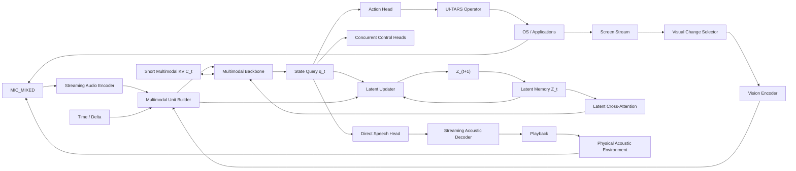

# 实时流多模态 LatentLoop 完整方案

> 状态：研究方案草案 v0.1
> 日期：2026-07-28
> 目标：构建持续接收真实麦克风和屏幕流、直接生成语音并控制电脑的 always-on 全双工多模态模型。

## 1. 方案概述

实时流多模态 LatentLoop 是一个运行在真实环境反馈闭环中的递归多模态模型。模型持续接收单路麦克风混合音频和屏幕视觉流，通过短窗口多模态 KV Cache 保存近期精确历史，通过固定容量 latent memory `Z_t` 保存长期目标、计划和连续内部状态，并并行输出直接语音和电脑动作。

完整闭环为：

```text
单路麦克风混合流 + 屏幕流
              ↓
     流式音频/视觉编码器
              ↓
   多模态主干 + 短窗口 KV + Z_t
              ↓
       ┌──────┴──────┐
   直接语音输出     Action Head
       ↓               ↓
 扬声器与真实环境   操作系统与应用
       ↓               ↓
 麦克风声学回流     屏幕/声音变化
       └──────┬───────┘
              ↓
         下一时间片输入
```

模型的两条递归路径分别是：

```text
内部即时路径：h_t -> Z_(t+1) -> 下一时间片主干

环境延迟路径：Speech/Action -> Environment
             -> MIC/Screen -> 下一时间片主干
```

`Z_t` 在环境反馈尚未返回时维持当前意图和任务状态；真实声音和屏幕变化随后进入模型，对内部状态进行确认、补充或修正。

## 2. 设计目标

1. 连续接收麦克风和屏幕输入，支持长时间 always-on 运行。
2. 模型说话和操作电脑时仍持续看、听和更新内部状态。
3. 支持用户在模型说话期间插话、补充、纠正和打断。
4. 从多模态 hidden state 直接生成语音的语义、韵律、音色和波形。
5. 语音和电脑动作可以并发输出。
6. 使用固定窗口 KV 和固定容量 `Z_t` 控制显存增长。
7. 由真实声学回流和屏幕变化提供输出结果反馈。
8. 在单人、双人、重叠语音、噪声和多人环境中保持稳定行为。
9. 通过独立 Action Head 对接 UI-TARS Operator。
10. 支持从小模型端到端原型逐步扩展到更大 Omni 模型。

## 3. 输入与输出

### 3.1 单路麦克风输入

模型接收设备在当前时刻采集到的完整单路音频：

$$
x_t^{mic}=u_t+e_t+o_t+n_t
$$

其中：

- `u_t`：当前用户或现场说话人的语音；
- `e_t`：模型输出语音经过声卡、扬声器、空间和麦克风后的回流；
- `o_t`：其他人、电视、音乐、电脑提示音等其他声音；
- `n_t`：环境噪声、设备噪声和声学失真。

模型直接从混合声学环境中学习语义理解、轮次控制、重叠语音处理和交互行为。

### 3.2 屏幕视觉输入

模型持续接收：

- 当前桌面或应用屏幕；
- 屏幕变化区域；
- 窗口切换和 UI 状态变化；
- 动作执行后的视觉结果。

屏幕采集采用高频采集、低频语义编码：采集器持续检测变化，只将关键帧和显著变化区域送入视觉编码器。

### 3.3 直接语音输出

语音输出路径为：

```text
Multimodal Backbone hidden
          ↓
    Direct Speech Head
          ↓
 Streaming Acoustic Decoder
          ↓
      Waveform Chunk
          ↓
       Playback
```

Speech Head 联合生成语义内容、音色、情绪、语速、停顿和韵律。输出以短波形块连续提交播放队列。

### 3.4 电脑动作输出

Action Head 输出结构化动作：

```text
NOOP
CLICK(x, y)
DOUBLE_CLICK(x, y)
RIGHT_CLICK(x, y)
DRAG(x1, y1, x2, y2)
SCROLL(dx, dy)
TYPE(text)
HOTKEY(keys)
WAIT(duration)
CANCEL
```

动作由 UI-TARS Operator 执行，结果通过后续屏幕和环境声音重新进入模型。

### 3.5 可选文本旁路

文本 head 可用于：

- 训练期间的语义辅助监督；
- 实时字幕；
- 调试和状态可观测性；
- 无声模式下的可选输出。

核心交互链路以直接语音和环境反馈为中心。

## 4. 核心状态

设系统按时间片 `t` 运行，定义：

| 符号 | 含义 |
|---|---|
| `A_t` | 当前新增混合音频 embedding 序列 |
| `V_t` | 当前新增视觉 embedding 序列 |
| `U_t` | 当前多模态时间单元 |
| `C_t` | 主干短窗口多模态 KV Cache |
| `Z_t` | 固定容量长期 latent memory |
| `H_t` | 当前时间片的主干 hidden 序列 |
| `q_t` | 当前时间片的统一状态向量 |
| `Y_t` | 当前生成的语音波形块 |
| `D_t` | 当前动作输出 |
| `R_t` | Speech Head 的局部声学连续状态 |

### 4.1 多模态 KV Cache `C_t`

每层 KV Cache 保存近期已经进入主干的多模态序列位置，包括：

- 混合音频 embedding；
- 屏幕视觉 embedding；
- 时间片和模态边界；
- 近期多模态注意力融合结果。

`C_t` 保存近期精确历史，长度随窗口而固定。旧时间单元以完整 unit 为单位淘汰。

### 4.2 Latent memory `Z_t`

$$
Z_t\in\mathbb R^{B\times M\times d_z}
$$

`Z_t` 由固定数量的 memory slots 构成，主要保存：

- 当前用户目标和长期约束；
- 当前任务阶段和未完成子目标；
- 对话语义、交互意图和响应计划；
- 当前应用、窗口和重要 UI 状态；
- 已经离开 KV 窗口的重要信息；
- 动作计划、错误恢复和安全状态；
- 环境反馈返回前需要连续保持的内部状态。

`Z_t` 的容量与运行时长无关。

### 4.3 Speech local state `R_t`

Speech Head 使用一个局部流式状态维持相邻语音块的连续性，例如：

- 最近声学帧；
- causal decoder cache；
- overlap-add 边界；
- 当前发音段的韵律进度。

`R_t` 服务于当前语音片段的声学连续生成；多模态理解和长期任务状态由 `C_t` 与 `Z_t` 负责。

### 4.4 三种状态的分工

| 状态 | 时间尺度 | 容量 | 职责 |
|---|---|---:|---|
| `R_t` | 20--100 ms | 小型固定/窗口状态 | 当前发音连续性 |
| `C_t` | 数秒到十几秒 | 固定短窗口 | 近期精确多模态历史 |
| `Z_t` | 跨分钟、任务和会话 | 固定 slots | 长期压缩状态与计划 |

## 5. 多模态时间单元

### 5.1 Unit 格式

每个主干时间片构造：

```text
<UNIT>
  time_embedding(delta_t)
  audio_embeddings(A_t)
  vision_embeddings(V_t)
  <STATE_QUERY>
</UNIT>
```

音频与视觉使用模态边界和共同时间轴。音频内容保持为真实混合声学表示，视觉内容保存当前关键帧或变化区域。

### 5.2 状态查询位置

`<STATE_QUERY>` 在最后层的 hidden state 定义为：

$$
q_t=H_t[\mathrm{STATE\_QUERY}]
$$

`q_t` 聚合当前 unit、短窗口 KV 和 `Z_t`，用于：

- 更新长期 latent memory；
- 直接语音生成；
- Action Head；
- 语音、动作和认知控制。

### 5.3 多频率调度

| 模块 | 推荐频率 |
|---|---:|
| 麦克风采集 | 16 kHz 或 24 kHz 连续采样 |
| 音频前端 | 20--40 ms 帧 |
| 音频编码块 | 100--250 ms |
| 屏幕采集 | 15--30 FPS |
| 视觉变化检测 | 10--15 Hz |
| 视觉语义编码 | 常态 1--2 FPS，变化时 4--5 FPS |
| 主干 unit tick | MVP 2 Hz，目标 5--10 Hz |
| Action Head | 2--5 Hz |
| 语音输出块 | 20--80 ms |
| `Z_t` 更新门 | 每 unit 计算，事件驱动写入 |

## 6. 模型架构



### 6.1 流式音频编码器

音频编码器增量处理最新音频块：

$$
A_t,K_{t+1}^{aud}=E_a(x_{t:t+\Delta}^{mic},K_t^{aud})
$$

`K_t^aud` 保存音频编码器近期卷积或注意力状态，使模型只处理新增音频。

### 6.2 视觉编码器

视觉选择器先检测变化：

$$
g_t=\mathrm{ChangeDetect}(x_t^{vis},x_{t-1}^{vis})
$$

存在有效视觉事件时：

$$
V_t=E_v(\mathrm{Select}(x_t^{vis},g_t))
$$

稳定屏幕使用空视觉事件或低频心跳帧。

### 6.3 多模态主干

当前 unit 为：

$$
U_t=\mathrm{Pack}(A_t,V_t,E_{time}(\Delta t))
$$

主干增量计算：

$$
H_t,C_{t+1}=F_\theta(U_t,C_t,Z_t)
$$

`Z_t` 通过每若干层插入的 cross-attention adapter 被主干读取：

$$
\widetilde H_t^{(l)}=H_t^{(l)}+
\mathrm{CrossAttn}(H_t^{(l)},Z_t,Z_t)
$$

这种结构使 `Z_t` 保持固定容量，并在每个新时间片立即可用。

## 7. LatentLoop 状态更新

### 7.1 候选 memory

$$
\widehat Z_{t+1}=G_\phi
\left(Z_t,q_t,\mathrm{Pool}(A_t),\mathrm{Pool}(V_t),E_{time}(\Delta t)\right)
$$

`G_phi` 建议使用 2--4 层轻量 Transformer，通过 cross-attention 读取当前多模态观察和状态查询。

### 7.2 写入门

逐 slot 写入门为：

$$
\alpha_t=\sigma\left(
W_\alpha[q_t;\mathrm{Pool}(Z_t);\mathrm{Pool}(U_t);E_{time}(\Delta t)]
\right)
$$

其中：

$$
\alpha_t\in[0,1]^{B\times M}
$$

更新公式：

$$
Z_{t+1}^{(i)}=\mathrm{Norm}\left(
(1-\alpha_t^{(i)})Z_t^{(i)}+
\alpha_t^{(i)}\widehat Z_{t+1}^{(i)}
\right)
$$

稳定背景和重复屏幕对应低写入率；新指令、视觉突变、动作结果和计划变化对应较高写入率。

### 7.3 即时内部状态

Speech Head 和 Action Head 输出后，`Z_t` 继续保存：

- 当前正在进行的表达意图；
- 当前动作计划；
- 环境结果尚未出现时的等待状态；
- 需要在下一时间片继续推进的任务信息。

真实声学与视觉结果进入后续 unit，模型据此更新 `C_t` 和 `Z_t`。

## 8. 直接语音生成

### 8.1 Speech Head

Speech Head 输入：

$$
(q_t,Z_t,R_t,c_t^{speech})
$$

输出：

$$
Y_t,R_{t+1}=S_\omega(q_t,Z_t,R_t,c_t^{speech})
$$

其中 `Y_t` 是短波形块或可由因果声学解码器立即转换为波形的声学表示。

### 8.2 实现候选

可选实现包括：

1. 连续声学 latent + 流式 flow decoder；
2. 低帧率声学 code + causal neural decoder；
3. 多尺度声学帧 + causal vocoder；
4. 直接波形块预测。

优先选择能满足以下要求的实现：

- 因果或有限 lookahead；
- 20--80 ms 输出块；
- 稳定的长语音连续性；
- 可中断和快速恢复；
- 实时因子小于 1；
- 可由多模态 hidden 直接条件化。

### 8.3 环境自听

模型语音经过以下链路：

$$
Y_t\rightarrow \mathrm{Playback}\rightarrow
\mathcal H_t(Y_{t-\delta})\rightarrow x_{t+\delta}^{mic}
$$

`\mathcal H_t` 表示设备和环境的真实声学变换。回流进入后续音频 encoder、主干 KV 和 Latent Updater，形成实际语音反馈。

## 9. Action Head 与 UI-TARS

### 9.1 Head 结构

动作类型：

$$
p(D_t^{type})=\mathrm{softmax}(W_a[q_t;\mathrm{Pool}(Z_t)])
$$

坐标参数：

$$
(x_t,y_t)=\sigma(W_{xy}[q_t;\mathrm{Pool}(Z_t)])
$$

其他参数由对应 head 或小型参数解码器产生。

### 9.2 动作提交

Action Head 输出标准协议：

```json
{"type":"click","x":0.42,"y":0.73,"confidence":0.94}
{"type":"type","text":"hello","confidence":0.97}
{"type":"hotkey","keys":["CTRL","L"],"confidence":0.99}
```

Harness 将其转换为 UI-TARS Operator 操作，并负责：

- 坐标与显示缩放映射；
- 屏幕版本校验；
- 动作限速；
- 执行超时；
- 危险动作审批；
- 全局紧急停止；
- 轨迹记录。

### 9.3 环境确认

动作结果在后续时间片中表现为：

- 页面、窗口或控件变化；
- 输入内容出现；
- 系统提示音；
- 用户语音确认、否定或纠正。

模型将这些新观察与 `Z_t` 中保存的动作意图对应，继续任务或进入错误恢复。

## 10. 并发控制

模型设置三组并行控制 head。

### 10.1 Speech Control

```text
SILENT / START / CONTINUE / PAUSE / STOP
```

### 10.2 Action Control

```text
NOOP / EXECUTE / CANCEL / WAIT_CONFIRMATION
```

### 10.3 Cognitive Control

```text
OBSERVE / UPDATE / SILENT_THINK / COMPACT / RESET
```

三组状态独立组合。例如：

```text
Speech = CONTINUE
Action = CLICK
Cognitive = UPDATE
```

表示模型继续说话、同时执行点击，并吸收新的麦克风和屏幕信息。

## 11. 完整状态转移

### 11.1 感知

$$
A_t,K_{t+1}^{aud}=E_a(x_{t:t+\Delta}^{mic},K_t^{aud})
$$

$$
V_t,K_{t+1}^{vis}=E_v(x_t^{vis},K_t^{vis})
$$

### 11.2 主干

$$
H_t,C_{t+1}=F_\theta(\mathrm{Pack}(A_t,V_t,\Delta t),C_t,Z_t)
$$

$$
q_t=H_t[\mathrm{STATE\_QUERY}]
$$

### 11.3 LatentLoop

$$
\widehat Z_{t+1}=G_\phi(Z_t,q_t,A_t,V_t,\Delta t)
$$

$$
Z_{t+1}=\mathrm{GatedUpdate}(Z_t,\widehat Z_{t+1})
$$

### 11.4 输出

$$
c_t=K_\kappa(q_t,Z_t)
$$

$$
Y_t,R_{t+1}=S_\omega(q_t,Z_t,R_t,c_t^{speech})
$$

$$
D_t=A_\eta(q_t,Z_t,c_t^{action})
$$

### 11.5 环境演化

$$
x_{t+\delta}^{mic}=\mathcal A
\left(x_{t+\delta}^{mic},\mathcal H_t(Y_t)\right)
$$

$$
E_{t+\delta}=\mathcal T(E_t,D_t)
$$

$$
x_{t+\delta}^{vis}=\mathrm{Render}(E_{t+\delta})
$$

其中 `A` 表示模型语音与现场其他声音在真实环境中的混合。

## 12. 上下文管理

### 12.1 短窗口 KV

KV 只保留最近 `W` 个完整 unit：

```text
C_t = KV(UNIT[t-W+1], ..., UNIT[t])
```

MVP 配置：

```text
unit = 500 ms
W = 16--32
近期精确历史 = 8--16 秒
```

模型以 unit 边界淘汰缓存，保持音频、视觉和时间对齐结构完整。

### 12.2 Latent compaction

在旧 unit 离开窗口前，执行一次压缩更新：

```text
即将淘汰的 unit summaries
          + Z_t
          ↓
    Latent Compaction
          ↓
       Z_(t+1)
```

压缩保留任务和未来行为相关的语义，释放近期声学和视觉细节。

### 12.3 持久化

会话级持久化保存：

- `Z_t` 的选定 slots；
- 当前任务结构化状态；
- 必要的安全和权限状态。

新的设备、模型版本或用户会话通过版本化 projector 恢复 latent state，或从结构化任务摘要重新初始化。

## 13. 实时运行时

### 13.1 运行线程

```text
Audio Capture       连续写入音频环形缓冲
Screen Capture      连续采集和变化检测
Perception          编码最新音频块和视觉事件
Backbone Worker     增量 forward、KV 与 Z 更新
Speech Worker       生成短语音块
Playback            按时间播放波形块
Action Worker       校验并执行电脑动作
Telemetry           记录延迟、队列、状态和轨迹
```

### 13.2 单 GPU 调度

单卡采用细粒度时间复用：

```text
音频增量编码
-> 可选视觉关键帧编码
-> 主干 unit forward
-> Latent update
-> 短语音块生成
-> Action Head
-> 下一个实时 unit
```

音频采集、屏幕采集、播放和动作执行由 CPU 与设备并发完成。

### 13.3 背压策略

当推理延迟超过实时 tick：

- 连续音频块合并为更粗粒度输入；
- 视觉只保留最新关键帧和累计变化区域；
- 暂停非关键主动语音；
- 缩短 Speech Head 的未来播放缓冲；
- 坐标动作在执行前校验屏幕版本；
- 记录时间跳跃并注入下一个 unit 的 `delta_t`。

目标是让积压恢复到实时状态，而不是让延迟随运行时间持续增长。

## 14. 训练数据

### 14.1 轨迹格式

每条训练轨迹包含：

```text
mic_audio:          带绝对时间戳的单路麦克风流
screen_frames:      带时间戳的屏幕关键帧或视频
target_speech:      模型应直接输出的语音波形
target_actions:     带时间戳的动作序列
control_targets:    语音、动作与认知控制状态
task_state:         任务目标、完成状态和错误状态
runtime_events:     播放、执行、丢帧和延迟记录
```

### 14.2 场景课程

#### 阶段 A：基础感知与生成

- 单人安静语音；
- 环境声音；
- 静态与动态屏幕；
- 直接语音生成；
- 单步 GUI grounding。

#### 阶段 B：声学反馈闭环

- 模型独立说话；
- 多种播放延迟和音量；
- 多种房间、距离和设备；
- 播放停止、截断和回流衰减；
- 长语音连续输出。

#### 阶段 C：双人全双工对话

- 用户与模型轮流说话；
- 用户短确认和否定；
- 模型边说边观察屏幕；
- 语音指令触发动作。

#### 阶段 D：重叠与打断

- 用户在模型说话时插话；
- 用户和模型同时说完整句子；
- 模型暂停、继续和停止；
- 错误打断后的恢复；
- 声学反馈延迟抖动。

#### 阶段 E：噪声与多人

- 键盘、风扇、音乐、电视和系统声音；
- 多人轮流和多人重叠；
- 不同音色、方向、距离和音量；
- 麦克风削波、自动增益和丢帧。

#### 阶段 F：完整电脑操作

- 屏幕、语音、动作和系统声音并发；
- 长任务和跨应用任务；
- 动作失败与用户纠正；
- 说话期间继续执行和观察；
- 长时间静默监控与主动提醒。

### 14.3 声学域随机化

训练场景覆盖：

- 房间 impulse response；
- 扬声器和麦克风频响；
- 播放延迟和时钟漂移；
- 非线性失真与自动增益；
- 距离衰减和方向变化；
- 背景噪声和瞬态声音；
- 回流截断、丢失和音量变化。

合成数据用于精确控制条件，真实设备录制用于覆盖实际声学域。

## 15. 训练目标

### 15.1 直接语音损失

$$
\mathcal L_{speech}=
\mathcal L_{acoustic}+
\lambda_{prosody}\mathcal L_{prosody}+
\lambda_{boundary}\mathcal L_{boundary}
$$

根据 Speech Head 实现，`L_acoustic` 可以是：

- 声学 code 交叉熵；
- flow matching；
- 多尺度频谱损失；
- 感知波形损失。

`L_boundary` 监督开始、继续、暂停和停止。

### 15.2 动作损失

$$
\mathcal L_{action}=
\mathcal L_{type}+
\lambda_{xy}\mathcal L_{coord}+
\lambda_{param}\mathcal L_{param}
$$

对高频 `NOOP` 使用类别重加权或 focal loss。

### 15.3 并发控制损失

$$
\mathcal L_{control}=
\mathcal L_{speech-control}+
\mathcal L_{action-control}+
\mathcal L_{cognitive-control}
$$

重点训练：

- 响应时机；
- 用户插话后的暂停或停止；
- 等待更多输入；
- 动作取消；
- 状态压缩和重置。

### 15.4 未来环境预测

`Z_t` 预测未来环境的压缩语义表示：

$$
\mathcal L_{future-aud}=1-
\mathrm{sim}(P_a(Z_t),\mathrm{sg}(E_a(x_{t+k}^{mic})))
$$

$$
\mathcal L_{future-vis}=1-
\mathrm{sim}(P_v(Z_t),\mathrm{sg}(E_v(x_{t+k}^{vis})))
$$

预测距离采用多个时间尺度，例如 0.5 秒、2 秒和 8 秒。

### 15.5 长期记忆损失

构造关键信息已经离开 KV 窗口的任务：

- 早期语音约束影响后续动作；
- 长任务目标跨多个窗口保持；
- 多次应用切换后继续原任务；
- 用户更新要求后执行新计划；
- 早期动作结果在后续被正确利用。

对这些样本增加任务完成、状态查询和未来动作监督。

### 15.6 写入正则

目标平均写入率：

$$
\mathcal L_{budget}=
(\mathrm{mean}(\alpha_t)-\rho)^2
$$

slot 多样性：

$$
\mathcal L_{div}=
\mathrm{mean}_{i\ne j}
(\widetilde Z_i^\top\widetilde Z_j)^2
$$

综合写入损失：

$$
\mathcal L_{write}=\lambda_b\mathcal L_{budget}+lambda_d\mathcal L_{div}
$$

### 15.7 总损失

$$
\mathcal L=
\lambda_{sp}\mathcal L_{speech}+
\lambda_{act}\mathcal L_{action}+
\lambda_{ctl}\mathcal L_{control}+
\lambda_{fa}\mathcal L_{future-aud}+
\lambda_{fv}\mathcal L_{future-vis}+
\lambda_{mem}\mathcal L_{memory}+
\lambda_w\mathcal L_{write}
$$

各 batch 使用 task mask，只计算具备有效标签的目标。

## 16. 闭环训练

### 16.1 训练分布

训练时未来麦克风包含目标语音经过声学环境后的结果；推理时未来麦克风包含模型实际生成语音的环境结果。通过课程式 rollout 对齐两种分布。

### 16.2 课程步骤

1. 使用目标语音和环境模型构造后续麦克风输入；
2. 混入模型生成语音构造的声学回流；
3. 使用不同 checkpoint 的输出覆盖语音错误分布；
4. 在真实设备和真实房间进行在线 rollout；
5. 训练播放截断、回流缺失、噪声和错误输出后的恢复。

### 16.3 梯度路径

可微训练路径包括：

```text
未来任务损失
-> 未来 hidden
-> Z_(t+k)
-> Latent Updater
-> Z_t / earlier hidden
```

长序列采用分块训练和 truncated BPTT，截断跨度覆盖需要验证的记忆时间。

物理环境闭环使用行为克隆、在线 rollout、偏好优化或强化学习训练。

## 17. 训练课程

### P0：基础模型

- 初始化流式音频编码器、视觉编码器和多模态主干；
- 训练直接 Speech Head；
- 训练基础 Action Head；
- 建立离线多模态时间片数据管线。

### P1：加入 LatentLoop

- 增加 latent slots；
- 增加 cross-attention adapter；
- 增加 2 层 Latent Updater 和逐 slot 门；
- 冻结或半冻结主干训练新增模块；
- 建立 latent on/off 指标。

### P2：短窗口与长期任务

- 逐步缩短 KV 窗口；
- 加入长任务和跨窗口约束；
- 加入未来音频/视觉 embedding 预测；
- 训练 latent compaction。

### P3：声学闭环

- 加入模型语音环境回流；
- 加入延迟、混响和设备随机化；
- 加入模型输出 rollout；
- 完成长时间连续对话测试。

### P4：全双工与多人

- 加入重叠语音和用户打断；
- 加入噪声与多人场景；
- 训练并发控制 heads；
- 优化停止延迟和队列稳定性。

### P5：电脑操作闭环

- 接入 UI-TARS Operator；
- 加入动作后视觉确认；
- 训练失败恢复和用户纠正；
- 加入安全审批与动作策略优化。

## 18. 推理算法

```text
状态：C, Z, K_audio, K_vision, R

每个实时 tick：
1. 读取最新麦克风音频块。
2. 获取最新屏幕关键帧或视觉空事件。
3. 增量编码得到 A_t 和 V_t。
4. 构造 UNIT_t，并使用 C_t、Z_t 做主干增量 forward。
5. 读取 q_t，更新 Z_(t+1)。
6. 并行预测 Speech、Action 和 Cognitive controls。
7. 生成短语音块并提交播放队列。
8. 提交有效电脑动作至 UI-TARS Operator。
9. 对即将淘汰的 unit 做 latent compaction。
10. 淘汰超出窗口的完整 KV unit。
11. 进入下一个 tick。

输出结果在未来通过麦克风和屏幕进入新的 UNIT。
```

### 18.1 伪代码

```python
def realtime_step(state, mic_chunk, screen_event, now):
    audio, state.audio_cache = audio_encoder.step(
        mic_chunk, state.audio_cache
    )
    vision, state.vision_cache = vision_encoder.step(
        screen_event, state.vision_cache
    )

    unit = pack_unit(
        audio=audio,
        vision=vision,
        delta_time=now - state.last_tick,
    )

    hidden, state.local_kv = backbone.step(
        unit=unit,
        local_kv=state.local_kv,
        latent_memory=state.latent,
    )
    query = hidden.state_query

    candidate, gate = latent_updater(
        memory=state.latent,
        query=query,
        observed_unit=unit,
    )
    state.latent = gated_update(state.latent, candidate, gate)

    controls = control_heads(query, state.latent)

    if controls.speech in {"START", "CONTINUE"}:
        waveform, state.speech_local = speech_head.step(
            query=query,
            latent_memory=state.latent,
            local_state=state.speech_local,
        )
        playback_queue.submit(waveform)
    elif controls.speech == "STOP":
        playback_queue.stop_future_audio()
        state.speech_local = speech_head.reset()

    action = action_head(query, state.latent, controls.action)
    if action.type != "NOOP":
        ui_tars_operator.submit(action)

    state.latent = compact_expiring_units(
        state.latent, state.local_kv
    )
    state.local_kv = evict_complete_old_units(state.local_kv)
    state.last_tick = now
    return state
```

## 19. MiniCPM 系基础实现

MiniCPM 系架构可提供以下基础能力：

- 视觉编码器和视觉 projector；
- 流式音频编码器；
- 多模态 embedding 接口；
- Qwen 类因果主干与增量 KV；
- unit/TDM 时间片组织；
- 滑动窗口和中断调度。

目标模型在此基础上增加：

1. Direct Speech Head；
2. 流式声学生成器；
3. 固定容量 `Z_t`；
4. Latent Cross-Attention；
5. Latent Updater 与写入门；
6. 独立 Action Head；
7. 并发控制 heads；
8. 明确的短 unit KV 窗口；
9. 单路混合音频和屏幕闭环训练。

## 20. 初始配置

### 20.1 研究模型

```text
总参数：1B--2.5B
多模态主干：0.7B--1.5B
视觉编码器：0.1B--0.4B
音频编码器：0.1B--0.3B
直接语音生成器：0.1B--0.4B
Latent Updater + Action/Control Heads：小于 0.1B
```

建议硬件为 24--80GB GPU。

### 20.2 RTX 2080 SUPER 8GB MVP

```text
总参数：0.15B--0.25B
屏幕分辨率：224--336
视觉语义编码：1--2 FPS
音频块：250--500 ms
主干 tick：2 Hz
近期 KV：8--16 秒
Z_t：8--16 slots，512--1024 dim
batch size：1 + gradient accumulation
FP16 + activation checkpointing
```

本机模型用于验证完整闭环、latent memory、直接语音和动作机制。

## 21. 评测与消融

### 21.1 基线

| 编号 | 方案 |
|---|---|
| A | 长 KV |
| B | 短 KV |
| C | 短 KV + `Z_t` |
| D | C + 声学环境闭环 |
| E | D + 重叠、噪声和多人课程 |
| F | E + Action Head 与视觉反馈闭环 |

### 21.2 语音指标

- 首语音块延迟；
- 实时因子 RTF；
- 长语音连续性；
- 用户插话后的暂停/停止延迟；
- 自声回流条件下的重复回应率；
- 回流延迟、音量和环境变化鲁棒性；
- 噪声、重叠与多人条件下任务成功率。

### 21.3 视觉与动作指标

- UI grounding 准确率；
- 动作成功率；
- 动作后状态恢复时间；
- 过期帧动作率；
- 无效重复动作率；
- 长任务完成率；
- 危险动作误执行率。

### 21.4 LatentLoop 指标

- `Z_t` on/off 性能差；
- KV 窗口缩短时的性能曲线；
- 长任务目标保持率；
- 写入门在不同事件上的分布；
- 活跃 slot 数量和多样性；
- `Z_t` 对未来任务阶段和环境状态的 probe 准确率；
- 固定显存下相对长 KV 的质量收益。

### 21.5 实时系统指标

- 麦克风采集到主干状态的延迟；
- 状态到语音播放的延迟；
- 动作提交和执行延迟；
- 队列积压随运行时间的变化；
- KV 与 latent 显存占用；
- 音频 underrun、视觉丢帧和动作超时；
- 1 小时、8 小时和 24 小时稳定性。

## 22. 风险与缓解

| 风险 | 缓解策略 |
|---|---|
| 模型对声学回流产生重复响应 | 强化声学闭环课程、延迟随机化、重复行为惩罚 |
| 回流较弱或暂时缺失 | 通过 `Z_t` 维持意图，训练多种回流强度和缺失场景 |
| 多人重叠导致交互错误 | 多人课程、等待控制、低置信度动作抑制 |
| `Z_t` 被短期 KV 忽略 | 逐步缩短 KV、窗口外任务、latent on/off 消融 |
| `Z_t` 过度记录声学或视觉细节 | 慢速门、写入预算、未来任务语义目标 |
| 重复屏幕帧占用上下文 | 变化检测、关键帧选择、完整 unit 淘汰 |
| 单卡吞吐跟不上实时速度 | 视觉降频、粗化音频块、量化和背压调度 |
| 动作基于过期屏幕 | 屏幕版本号、动作时效和执行前校验 |
| 长时间队列延迟增长 | 实时延迟监控、帧合并、输出节流和超时恢复 |
| 隐状态难以审计 | 状态 probe、动作审批、完整轨迹和紧急停止 |

## 23. 安全边界

UI-TARS Harness 提供：

- 删除、支付、发送、安装和权限修改审批；
- 操作区域和应用白名单；
- 输入文本脱敏；
- 全局停止快捷键；
- 每秒动作上限；
- 屏幕版本校验；
- 操作轨迹记录与回放；
- 无人值守策略。

语音运行时提供：

- 最大连续输出时长；
- 音量限制；
- 异常重复检测；
- 播放队列上限；
- 用户打断优先级。

## 24. 实现路线图

### R0：离线最小模型

- 预录单路混合音频；
- 稀疏屏幕帧；
- Direct Speech Head；
- 基础多模态主干；
- 离线端到端推理。

### R1：实时感知与语音

- Windows 麦克风和屏幕采集；
- 流式 Audio/Vision Encoder；
- 短窗口 KV；
- 连续语音播放；
- 端到端延迟基准。

### R2：LatentLoop

- `LatentState` 数据结构；
- cross-attention adapter；
- Latent Updater；
- 写入门和状态监控；
- 短 KV 长任务消融。

### R3：声学环境闭环

- 扬声器到麦克风真实回流；
- 重叠与打断数据；
- 模型语音 rollout；
- 1 小时连续运行测试。

### R4：Action Head

- UI-TARS SDK 集成；
- 动作协议和坐标映射；
- 动作后视觉闭环；
- 错误恢复与安全审批。

### R5：完整 always-on Agent

- 语音、视觉和动作并发；
- `Z_t` 持久化与清理；
- 8--24 小时稳定性；
- Windows 真实任务评测；
- 本地量化和性能优化。

## 25. 成功标准

1. 模型能持续处理单路混合麦克风和屏幕流。
2. Direct Speech Head 达到实时生成并保持长语音连续性。
3. 模型在自身语音环境回流存在时保持正确对话行为。
4. 用户插话后在目标延迟内暂停、停止或调整响应。
5. 短 KV + `Z_t` 在长任务上显著优于相同窗口的普通模型。
6. Action Head 能通过 UI-TARS 完成动作并利用后续屏幕继续任务。
7. KV 显存保持有界，`Z_t` 容量与运行时长无关。
8. `Z_t` 消融显著降低长期目标保持和错误恢复能力。
9. 噪声、重叠和多人场景的成功率随训练课程稳定提升。
10. 长时间运行过程中系统延迟和队列长度保持稳定。

## 26. 最终架构定义

实时流多模态 LatentLoop 的最终形态为：

```text
单路混合麦克风输入
+ 屏幕视觉流
+ 流式音频/视觉编码器
+ 短窗口统一多模态 KV
+ 固定容量循环 latent memory Z_t
+ Direct Speech Head
+ 独立 Action Head
+ 并发控制 Heads
+ UI-TARS Operator
+ 真实声学与视觉环境反馈
```

KV 负责近期精确历史，`Z_t` 负责长期压缩状态和即时内部递归，Direct Speech Head 负责实时语音，Action Head 负责电脑操作。扬声器、房间、麦克风、操作系统和屏幕共同构成模型的外部反馈环境，从而形成持续运行的多模态 LatentLoop。
